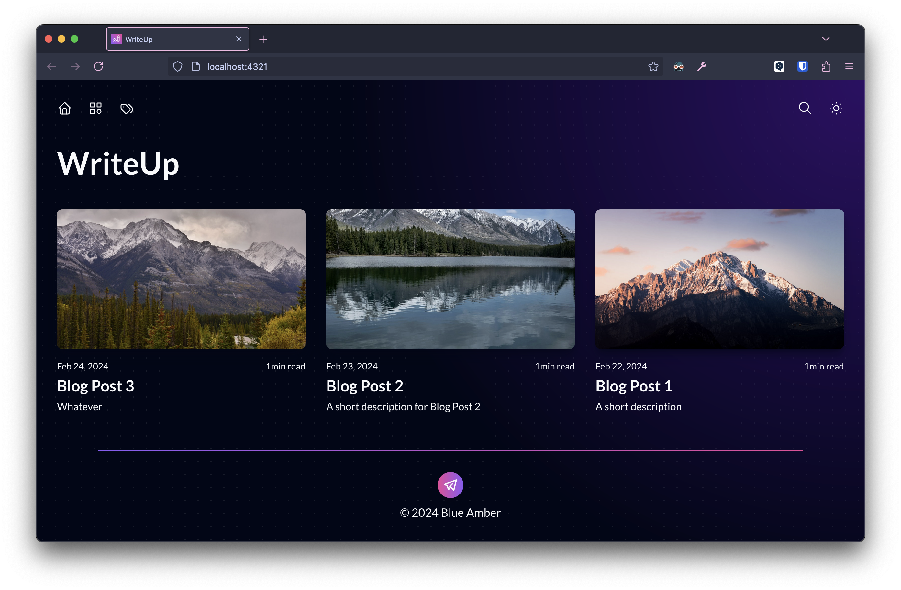

# WriteUp 🖊️

## [Getting started](https://github.com/blueambr/writeup/wiki)

Tecnhnologies used:

- [Alpine.js](https://alpinejs.dev/)
- [Astro](https://astro.build/)
- [clsx](https://github.com/lukeed/clsx)
- [ESLint](https://eslint.org/)
- [husky](https://github.com/typicode/husky)
- [Keystatic](https://keystatic.com/)
- [lint-staged](https://github.com/lint-staged/lint-staged)
- [Markdoc](https://markdoc.dev/)
- [Pagefind](https://pagefind.app/)
- [PhotoSwipe](https://photoswipe.com/)
- [Prettier](https://prettier.io/)
- [svg-sprite](https://github.com/svg-sprite/svg-sprite)
- [SVGO](https://github.com/svg/svgo)
- [Tailwind CSS](https://tailwindcss.com/)
- [TypeScript](https://www.typescriptlang.org/)
